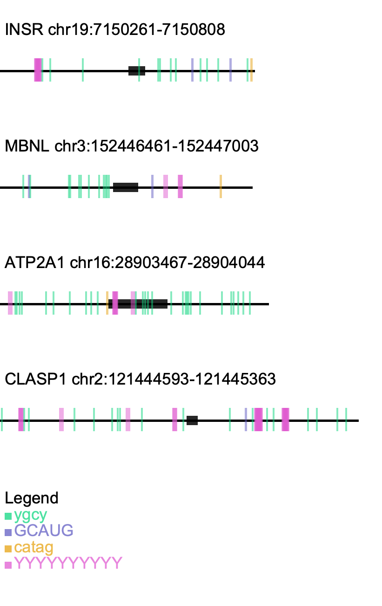

# Motifs

Our goal is to generate a diagram indicating the location of motifs within our genes of interest. To do this we will scan through each fasta record looking for our motifs of interest (accounting for any existing wobble sequence). Any motifs found will be added to our diagram.

This diagram is outputted as a `.png`

## Usage

```bash
./motif-mark-oop.py -f fasta_file -m motif_file
```

**-f:** Fasta file containing our sequences. Records must have their introns denoted by lower case characters and exons by uppercase characters.

**-m:** Motif file, with a single motif sequence per line. Motif sequences must be IUPAC characters.

**Output (png) file:** Named based on our fasta file (Fig1.fasta --> Fig1.png)

## Example Output



## Dependencies needed

The only package needed which is not found within base python is `pycairo`